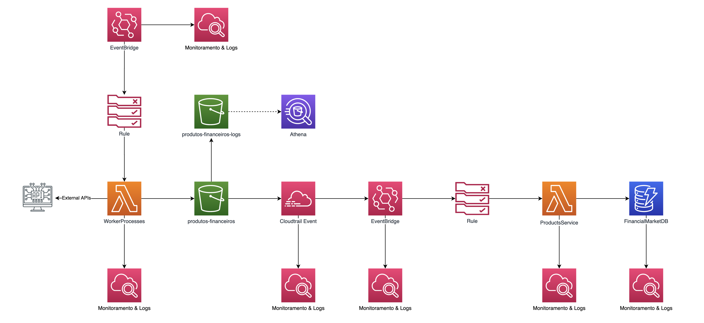

# ProductsService

# PortfolioService

# Monitoring

# Justificativa para cada produto da AWS que foi utilizado

* Dynamodb, performance de milisegundos em qualquer escala de dados
* SQS - SNS, serviços padrao para mensageria na AWS
* Lambda, utilização de framework serverless e implementação de rapida da solução
* API Gateway, serviço padrao para APIs REST, integração nativa com Lambda e SQS
* S3, serviço padrao para storage de baixo custo e com performance
* CloudTrail - EventBridge: comunicação de eventos com melhor performance que s3 events
* Xray, solução de monitoramento de aplicação (traces) nativa da AWS 
* Chatbot, integração com SLACK
* CloudWatch, solução de monitoramento padrão na AWS

# Custo mensal infra

Custo total aproximado:  $100 - $150

* CloudWatch
	* Configurção: Metricas, Logs, Alarmes, ServiceLens e Lambda Insights 
	* Custo Mensal USD: $50 - $70

* Dynamodb:
	* Configuração: 25 WCUs, 25 RCUs e 25GB (free tier limite)
	* Custo Mensal USD: $21

* Xray
	* Configurção: 1 milhão de solicitações
	* Custo Mensal USD: $7
	* 	
* API Gateway
	* Configuraão: 1 milhão de chamadas (api, http e mensagens) e 750000 minutos de conexão (free tier)
	* Custo Mensal USD: Primeiros 300 milhões $1 por milhão

* CloudTrail
	* Configurção: 1 milhão de eventos
	* Custo Mensal USD: $1 ($0.10 a cada 100000 eventos)
	
* EventBridge
	* Configurção: 1 milhão de eventos
	* Custo Mensal USD: $1 por milhão
	
* SQS: 
	* Configurção: sobre 1 milhão de solicitações (free tier limite)
	* Custo Mensal USD: $0.5 por milhão (Fila FIFO)

* SNS
	* Configurção: sobre 1 milhão de solicitações (free tier limite)
	* Custo Mensal USD: $0.5 por milhão (Topico Padrão)

* Serverless
	* Configurção: sobre 1 milhão de solicitações (128MB e 200ms)
	* Custo Mensal USD: $0.2 por milhão 
	
* S3
	* Configurção: max 50TB
	* Custo Mensal USD: $0.023 por GB
	
* Chatbot
	* Custo Mensal USD: $0

# RTO & RPO

## RTO
Como é tudo Serverless (ate o banco) o RTO é muito baixo, poderiamos falar de milisegundos.

## RPO
Toda a infra seria criada com IaC, pelo que criar ela desde zero nao levaria muito tempo. O ponto mais critico seriao banco e o bucket s3 que salva as informações que vem dos workers. O banco tem replicação em 3 AZ pelo que é estremamente estavel, alem disso tem "Recovery point in time", o que permite recuperar o banco ate 5 minutos antes de estado atual. O bucket s3 pode ter replicaçao automatica, o que ajudaria no processo de restauração de dados.

Tomando em consideraçao esses pontos. Recupera o ambiente despis de uma falha poderia ser menos de uma hora, com perda de dados do maximo 5 minutos.
